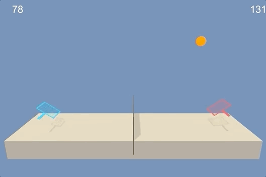
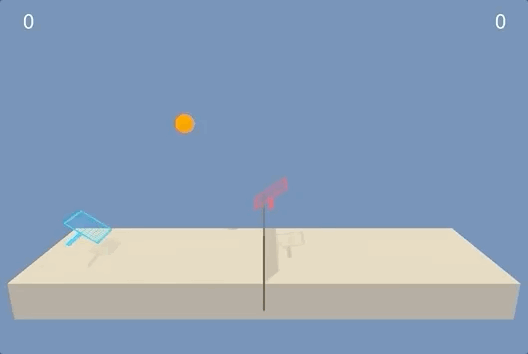

# tennis-maddpg

Random agents              |  Trained agents
:-------------------------:|:-------------------------:
 | 

*Examples of a random agent and an agent trained to position its arm within the (green) target region.*

> *Note*: The code in this repo is based on my original implementation of DDPG, which can be found [here](https://github.com/jstol/reacher-ddpg).

# The Model and Environment
This project implements [Multi-Agent Deep Deterministic Policy Gradient (MADDPG)](https://papers.nips.cc/paper/7217-multi-agent-actor-critic-for-mixed-cooperative-competitive-environments.pdf) [1]
to solve the ["Tennis" Unity ML Environment](https://github.com/Unity-Technologies/ml-agents/blob/master/docs/Learning-Environment-Examples.md#tennis).
The goal in this environment is to train two agents to hit a ball over a net with a racquet. Each individual agent is 
rewarded for hitting the ball over the net, and penalized when they hit it out of bounds or allow it to drop; therefore,
both collaboration and competition is required to solve the environment. This project was completed as part of the
[(Unity-sponsored) Udacity course on Deep Reinforcement Learning](https://unity3d.com/learn/drl-nanodegree).

## Observation Space
24 real-valued variables describing the position and velocity of the ball and raquet. Each agent has its own local
observation at each timestep. 

## Action Space
A float vector of size 2. One entry controls horizontal movement, while the other controls vertical movement. (Every
entry is bound between [-1, +1].)

## Reward Function
Each agent receives a reward of +0.1 for hitting the ball over the net, and -0.01 if the ball hits the ground on the 
agent's side or if the agent hits the ball out-of-bounds.

## Solved
The environment is considered solved when the agent can receive an average reward of +0.5 or more, over a window of 100
episodes. (Note: the reawrd per agent is summed over each episode, and the max of this value is taken as the episode
score).

## Setup
### Code Setup
Based on the Udacity setup (see [here](https://github.com/udacity/deep-reinforcement-learning/tree/55474449a112fa72323f484c4b7a498c8dc84be1#dependencies)),
Conda/virtualenv can be used to install the required dependencies. For example:
```bash
virtualenv --python=python3 venv
source venv/bin/activate
pip install -r requirements.txt
```

### Environment Setup
The environment executable can be downloaded for different platforms.
- [Linux](https://s3-us-west-1.amazonaws.com/udacity-drlnd/P3/Tennis/Tennis_Linux.zip)
- [Mac OSX](https://s3-us-west-1.amazonaws.com/udacity-drlnd/P3/Tennis/Tennis.app.zip) 
- [Windows (32-bit)](https://s3-us-west-1.amazonaws.com/udacity-drlnd/P3/Tennis/Tennis_Windows_x86.zip)
- [Windows (64-bit)](https://s3-us-west-1.amazonaws.com/udacity-drlnd/P3/Tennis/Tennis_Windows_x86_64.zip)

# Project Structure
## `Report.md`
A document detailing some of the implementation details and ideas for future work.

## `main.py`
Contains a CLI used for training and visualizing the model.

## `maddpg/`
The main module.
### `agent.py`
Contains the Agent class, used to organize the Policy/Q-Net of each agent.
### `models.py`
Contains definitions of the Policy/Q-Net (Actor/Critic) models.
### `runner.py`
Contains functions for training and visualizing agents.
### `utils.py`
Various utilities for managing the environment and training loop.

## `models/`
Contains pretrained models.
### `policy_net.0.pth` and `policy_net.1.pth`
Pre-trained Policy Nets (Actors) for each agent.
### `q_net.0.pth` and `q_net.1.pth`
Pre-trained Q-Nets (Critics) for each agent.

# Training and Visualizing
The `main.py` script can be used to train agents and visualize them.

To train:
```
python3 main.py train
```

To visualize:
```
python3 main.py visualize models/
```

# References
1. [Lowe, Ryan, Yi Wu, Aviv Tamar, Jean Harb, Pieter Abbeel and Igor Mordatch. “Multi-Agent Actor-Critic for Mixed Cooperative-Competitive Environments.” ArXiv abs/1706.02275 (2017): n. pag.](https://www.semanticscholar.org/paper/Multi-Agent-Actor-Critic-for-Mixed-Environments-Lowe-Wu/7c3ece1ba41c415d7e81cfa5ca33a8de66efd434)
