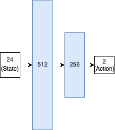
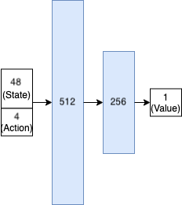
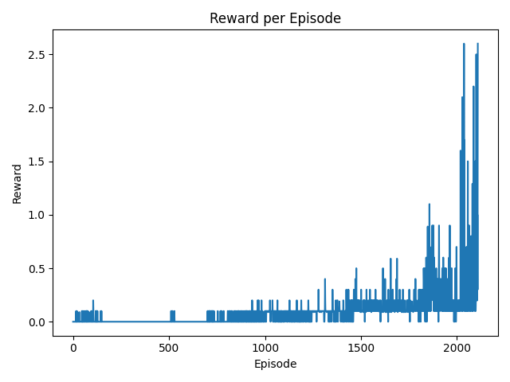

# Solving the Tennis Environment with MADDPG 
[Deep Deterministic Policy Gradient (DDPG)](https://spinningup.openai.com/en/latest/algorithms/ddpg.html) [1] allows an 
agent to learn a policy that operates in continuous action spaces. [Multi-Agent Deep Deterministic Policy Gradient (MADDPG)](https://papers.nips.cc/paper/7217-multi-agent-actor-critic-for-mixed-cooperative-competitive-environments.pdf) 
[2] is an extension to multiple agents. In this project, we use MADDPG to solve the
["Tennis" Unity ML Environment](https://github.com/Unity-Technologies/ml-agents/blob/master/docs/Learning-Environment-Examples.md#tennis).

The goal in this environment is to train two agents to hit a ball over a net with a racquet. Each individual agent is 
rewarded for hitting the ball over the net, and penalized when they hit it out of bounds or allow it to drop; therefore,
both collaboration and competition is required to solve the environment.

# Environment
## Observation Space
24 real-valued variables describing the position and velocity of the ball and raquet. Each agent has its own local
observation at each timestep. 

## Action Space
A float vector of size 2. One entry controls horizontal movement, while the other controls vertical movement. (Every
entry is bound between [-1, +1].)

## Reward Function
Each agent receives a reward of +0.1 for hitting the ball over the net, and -0.01 if the ball hits the ground on the 
agent's side or if the agent hits the ball out-of-bounds.

## Solved
The environment is considered solved when one of the agents can receive an average reward of +0.5 or more, over a window
of 100 episodes. (Note: the reward per agent is summed over each episode, and the max of this value is taken as the
episode score.)

## Learning Algorithm
### Architecture
Each agent has an "Actor" and a "Critic" neural network. Both the Actor and Critic nets are feed-forward neural networks
with 2 hidden layers – one with 512 neurons and one with 256 neurons. All hidden units use ReLU activations. For this
project, both the Actor and Critic make use of batch normalization after the input layer, and the Actor also includes it
after all hidden layers. The architecture diagrams below show the input, hidden and outputs layers, as well as the size
of each of these layers.

#### Policy Network ("Actor")

#### Q-Net ("Critic")
> *Note*: MADDPG critics have access to both its own agent's state/actions, as well as those of the other agents.
> Therefore, in this case, the "full" state is 48-dimensional and the "full" actions is 4-dimensional.

### Hyperparameters
The following hyperparameter settings were used. (*Note*: a proper hyperparameter search could be performed in the
future). Both the actor and critic networks use the Adam optimizer.

|Hyperparameter|Setting|Description
|---|---|---|
|**Random Exploration Span**|150|This value controls for how long (in episodes) the agent does purely random exploration before using it's policy to collect experience.|
|**Max Episodes**|5,000|The maximum number of episodes to run for.|
|**Batch Size**|256|The size of the minibatches to use for SGD.|
|**Update Frequency**|10|After how many timesteps the models should be updated.|
|**Number of Inner Updates**|10|When updating the models (as defined by the Update Frequency), this setting defines how many consecutive rounds of SGD should be completed before continuing.|
|**Initial Noise STDEV**|0.25|While using an agent to gain experience, random noise is also added to the action space to help encourage exploration. This noise is sampled from a normal distribution. The standard deviation is initially set to 0.25 and decays per episode.|
|**Minimum Noise STDEV**|1e-3|The minimum the standard deviation of the noise distribution should be decayed to.|
|**Noise STDEV Decay Rate**|0.998|The rate to decay the standard deviation of the noise distribution, per episode.|
|**Max Replay Size**|100,000|The maximum number of experience tuples to store in the experience buffer.|
|**Gamma**|0.99|The future reward discount factor.|
|**Tau**|0.001|The (soft) mixing factor to use when updating target network weights.|
|**Policy Learning Rate**|0.002|The learning rate to use when training the policy (actor) network.|
|**Q-Net Learning Rate**|0.002|The learning rate to use when training the Q-Net (critic) network.|
|**Weight Decay**|0.0|The strength of L2 regularization to use when training any network.|

## Plot of Rewards
Below is a plot of the rewards earned by the agents during training (within a sliding window of 100 episodes).

The environment was solved after 2109 episodes (as the goal of an average reward of +0.5 is reached).

## Future Work
Some ideas for future work:
- Hyperparameter search: A search method such as grid/random search could be used to determine the most effective
  DDPG hyperparameter settings for this environment.
- Prioritized experience replay: Currently, all experience tuples are sampled uniformly. This distribution can be
  modified so that informative tuples are sampled more frequently (which often helps to make learning more stable). 
- Experiment with shared components: Often, sharing subcomponents between agents can help with learning (for example,
  sharing a single policy.)
- Other algorithms for multi-agent reinforcement learning (MARL), could also be implemented and compared to DDPG. See 
  [3] for more info and ideas.

## References
1. [Lillicrap, Timothy P., Jonathan J. Hunt, Alexander Pritzel, Nicolas Manfred Otto Heess, Tom Erez, Yuval Tassa, David Silver and Daan Wierstra. “Continuous control with deep reinforcement learning.” CoRR abs/1509.02971 (2016): n. pag.](https://www.semanticscholar.org/paper/Continuous-control-with-deep-reinforcement-learning-Lillicrap-Hunt/024006d4c2a89f7acacc6e4438d156525b60a98f)
2. [Lowe, Ryan, Yi Wu, Aviv Tamar, Jean Harb, Pieter Abbeel and Igor Mordatch. “Multi-Agent Actor-Critic for Mixed Cooperative-Competitive Environments.” ArXiv abs/1706.02275 (2017): n. pag.](https://www.semanticscholar.org/paper/Multi-Agent-Actor-Critic-for-Mixed-Environments-Lowe-Wu/7c3ece1ba41c415d7e81cfa5ca33a8de66efd434)
3. [Zhang, Kaiqing, Zhuoran Yang and Tamer Başar. “Multi-Agent Reinforcement Learning: A Selective Overview of Theories and Algorithms.” ArXiv abs/1911.10635 (2019): n. pag.](https://www.semanticscholar.org/paper/Multi-Agent-Reinforcement-Learning%3A-A-Selective-of-Zhang-Yang/54d4a221db5a91a2487b1610374843fafff5a23d)
